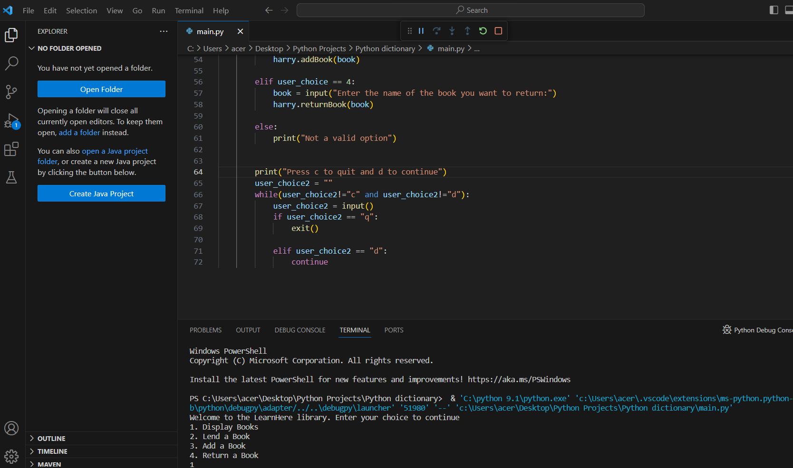
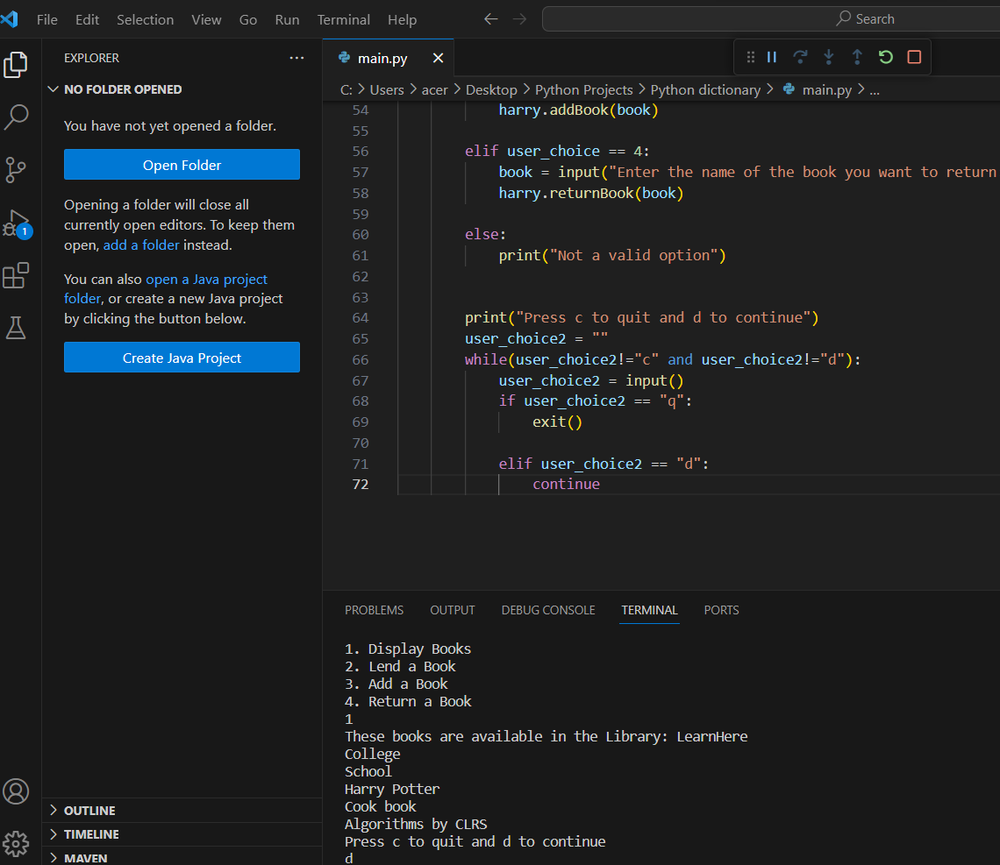

# BookSystem_Python
This is a library made using Python. It has four functions by which you can, display the list of books,borrow a book,return a book and add a new bookto the library.

## Requirements
* VS Code
* Python

## Code 

* [Code](code/code)
